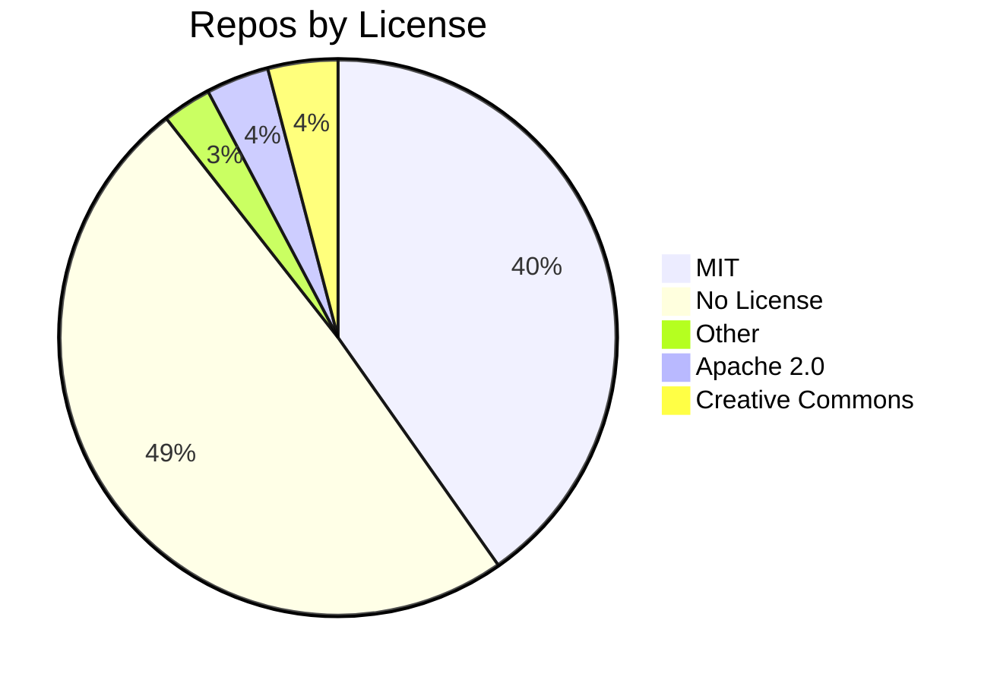

       

# 📋 Awesome MCP Repos

**Every awesome-mcp repository on GitHub. Sorted, enriched, and updated daily.**

<table>
  <tr>
    <td align="center">
       
      Total Repositories
    </td>
    <td align="center">
       
      Combined Stars
    </td>
    <td align="center">
       
      Combined Forks
    </td>
  </tr>
</table>

> [!NOTE]
> This table shows every awesome-mcp repository discovered on GitHub. Updated daily via GitHub Actions.

<b>License Distribution</b>

| Repository | Stars | Forks | License | Created | Updated | Description |
| ---------- | ----: | ----: | ------- | ------- | ------- | ----------- |
| [vivekkeditz/Awesome-MCP-ZH](https://github.com/vivekkeditz/Awesome-MCP-ZH) | 0 | 0 | MIT License | 2025-04-05 | 2026-02-08 | MCP 资源精选， MCP指南，Claude MCP，MCP Servers, MCP Clients |
| [roti-c137/awesome-mcp](https://github.com/roti-c137/awesome-mcp) | 1 | 1 | - | 2025-04-15 | 2026-02-08 | - |
| [ojlee6207/awesome-offensive-mcp](https://github.com/ojlee6207/awesome-offensive-mcp) | 7 | 0 | Other | 2023-12-14 | 2026-02-08 | 🛠️ Discover curated MCP servers for Red Teaming and Pentesting, enhancing your offensive security tools with essential resources for effective vulnerability research. |
| [Rodert/awesome-mcp](https://github.com/Rodert/awesome-mcp) | 0 | 0 | Apache License 2.0 | 2025-11-22 | 2026-02-08 | A curated list of MCP servers and related resources. |
| [jpatterson933/awesome-mcp-server-index](https://github.com/jpatterson933/awesome-mcp-server-index) | 0 | 0 | - | 2026-02-05 | 2026-02-08 | A collection of existing actively managed or inactive awesome-mcp server collections |
| [timunbasah3/awesome-mcp](https://github.com/timunbasah3/awesome-mcp) | 10 | 2 | - | 2025-08-10 | 2026-02-08 | 🚀 Discover and explore a curated list of MCP servers, tools, and resources for AI assistants, enhancing your development and productivity. |
| [ayaanjan76/awesome-mcp-servers](https://github.com/ayaanjan76/awesome-mcp-servers) | 1 | 0 | MIT License | 2025-10-02 | 2026-02-08 | 🚀 Explore a curated collection of top Model Context Protocol (MCP) servers for seamless connectivity and enhanced experiences in your projects. |
| [umairakrm007/awesome-mcp-servers](https://github.com/umairakrm007/awesome-mcp-servers) | 1 | 0 | MIT License | 2021-03-10 | 2026-02-08 | 🚀 Discover and deploy powerful MCP servers with curated setups, templates, and tools to enhance your Minecraft experience effortlessly. |
| [sunnamed434/awesome-mcp-registry](https://github.com/sunnamed434/awesome-mcp-registry) | 0 | 0 | MIT License | 2026-02-05 | 2026-02-08 | AI-curated, self-updating directory of MCP servers. Discovered from GitHub & the official registry, analyzed and ranked by AI weekly. |
| [NeuralRays/awesome-mcp-hub](https://github.com/NeuralRays/awesome-mcp-hub) | 0 | 0 | MIT License | 2026-02-08 | 2026-02-08 | The curated, comprehensive directory of MCP servers and clients — with quality reviews, compatibility info, and difficulty ratings. |
| [gauravfs-14/awesome-mcp](https://github.com/gauravfs-14/awesome-mcp) | 9 | 0 | Other | 2025-06-15 | 2026-02-08 | A carefully curated collection of high-quality tools, libraries, research papers, projects, and tutorials centered around Model Context Protocol (MCP) — a novel paradigm designed to enable modular, adaptive coordination between large language models (LLMs) and external tools or data contexts. |
| [YuzeHao2023/Awesome-MCP-Servers](https://github.com/YuzeHao2023/Awesome-MCP-Servers) | 1,020 | 34 | Apache License 2.0 | 2025-11-06 | 2026-02-08 | A curated list of Model Context Protocol (MCP) servers  |
| [abordage/awesome-mcp](https://github.com/abordage/awesome-mcp) | 1 | 0 | MIT License | 2025-12-25 | 2026-02-07 | Curated list of Model Context Protocol (MCP) servers, clients, and frameworks. Automatically updated daily. |
| [RbBtSn0w/awesome-copilot-mcp](https://github.com/RbBtSn0w/awesome-copilot-mcp) | 1 | 0 | MIT License | 2026-01-29 | 2026-02-07 | A Model Context Protocol (MCP) server that provides access to awesome-copilot agents and collection resources. |
| [JustInCache/awesome-mcp-collection](https://github.com/JustInCache/awesome-mcp-collection) | 5 | 0 | MIT License | 2026-02-02 | 2026-02-06 | The most comprehensive, curated collection of MCP servers with ready-to-use configurations |
| [SciSharp/Awesome-DotNET-MCP](https://github.com/SciSharp/Awesome-DotNET-MCP) | 123 | 15 | Creative Commons Zero v1.0 Universal | 2025-03-13 | 2026-02-05 | Awesome ModelContextProtocol resources - A curated list of MCP DotNET resources |
| [TensorBlock/awesome-mcp-servers](https://github.com/TensorBlock/awesome-mcp-servers) | 537 | 85 | MIT License | 2025-04-04 | 2026-02-05 | A comprehensive collection of Model Context Protocol (MCP) servers |
| [WagnerAgent/awesome-mcp-servers-devops](https://github.com/WagnerAgent/awesome-mcp-servers-devops) | 77 | 16 | Creative Commons Zero v1.0 Universal | 2025-12-10 | 2026-02-04 | A curated, DevOps-focused list of Model Context Protocol (MCP) servers—covering source control, IaC, Kubernetes, CI/CD, cloud, observability, security, and collaboration—with a bias toward maintained, production-ready integrations. |
| [yzfly/Awesome-MCP-ZH](https://github.com/yzfly/Awesome-MCP-ZH) | 6,081 | 382 | MIT License | 2025-04-03 | 2026-02-04 | MCP 资源精选， MCP指南，Claude MCP，MCP Servers, MCP Clients |
| [bh-rat/awesome-mcp-enterprise](https://github.com/bh-rat/awesome-mcp-enterprise) | 98 | 21 | - | 2025-08-12 | 2026-02-04 | A curated list of awesome MCP (Model Context Protocol) tools, platforms, and services for enterprises. |
| [jaw9c/awesome-remote-mcp-servers](https://github.com/jaw9c/awesome-remote-mcp-servers) | 992 | 139 | MIT License | 2025-04-06 | 2026-02-03 | Remote MCP Servers |
| [shadowrootdev/awesome-agent-skills-mcp](https://github.com/shadowrootdev/awesome-agent-skills-mcp) | 2 | 0 | MIT License | 2026-02-03 | 2026-02-03 | MCP server providing 100+ AI agent skills from Anthropic, Vercel, Trail of Bits, Hugging Face & more. Works with Claude, GitHub Copilot, and any MCP client. |
| [Daeda-Technologies-Ltd/Awesome-MCP-Servers](https://github.com/Daeda-Technologies-Ltd/Awesome-MCP-Servers) | 3 | 0 | Creative Commons Zero v1.0 Universal | 2026-02-03 | 2026-02-03 | A curated list of MCP servers that we've actually tested and can vouch for |
| [fuzzylabs/awesome-secure-mcp-servers](https://github.com/fuzzylabs/awesome-secure-mcp-servers) | 0 | 1 | MIT License | 2025-06-24 | 2026-02-08 | A curated list of Model Context Protocol (MCP) servers with comprehensive security validation using the mcp-scan security assessment pipeline |
| [punkpeye/awesome-mcp-servers](https://github.com/punkpeye/awesome-mcp-servers) | 80,504 | 7,073 | MIT License | 2024-11-30 | 2026-02-01 | A collection of MCP servers. |
| [korchasa/awesome-mcp](https://github.com/korchasa/awesome-mcp) | 2 | 0 | Creative Commons Zero v1.0 Universal | 2025-02-27 | 2026-01-31 | This curated list focuses on tools, implementations, and resources for the Model Context Protocol |
| [dingodb/awesome-dingodb-mcp](https://github.com/dingodb/awesome-dingodb-mcp) | 1 | 1 | - | 2026-01-29 | 2026-01-30 | MCP Server for DingoDB database and its tools |
| [ondatra-ai/awesome-claude-mcp](https://github.com/ondatra-ai/awesome-claude-mcp) | 0 | 0 | MIT License | 2025-09-06 | 2026-01-27 | - |
| [BlockRunAI/awesome-marketing-mcp](https://github.com/BlockRunAI/awesome-marketing-mcp) | 1 | 0 | - | 2026-01-17 | 2026-01-26 | A curated list of MCP servers for marketing and growth |
| [BlockRunAI/awesome-creator-mcp](https://github.com/BlockRunAI/awesome-creator-mcp) | 1 | 0 | - | 2026-01-17 | 2026-01-26 | A curated list of MCP servers for content creators |
| [BlockRunAI/awesome-research-mcp](https://github.com/BlockRunAI/awesome-research-mcp) | 1 | 0 | - | 2026-01-17 | 2026-01-25 | A curated list of MCP servers for research and academia |
| [BlockRunAI/awesome-data-mcp](https://github.com/BlockRunAI/awesome-data-mcp) | 1 | 0 | - | 2026-01-17 | 2026-01-25 | A curated list of MCP servers for data engineering and analytics |
| [BlockRunAI/awesome-productivity-mcp](https://github.com/BlockRunAI/awesome-productivity-mcp) | 1 | 0 | - | 2026-01-17 | 2026-01-25 | A curated list of MCP servers for productivity tools |
| [BlockRunAI/awesome-ai-mcp](https://github.com/BlockRunAI/awesome-ai-mcp) | 0 | 0 | - | 2026-01-17 | 2026-01-24 | A curated list of MCP servers for AI and machine learning |
| [BlockRunAI/awesome-devops-mcp](https://github.com/BlockRunAI/awesome-devops-mcp) | 1 | 0 | - | 2026-01-17 | 2026-01-24 | A curated list of MCP servers for DevOps and cloud infrastructure |
| [punkpeye/awesome-mcp-clients](https://github.com/punkpeye/awesome-mcp-clients) | 6,269 | 503 | MIT License | 2025-01-11 | 2026-01-23 | A collection of MCP clients. |
| [punkpeye/awesome-mcp-devtools](https://github.com/punkpeye/awesome-mcp-devtools) | 413 | 100 | MIT License | 2025-04-27 | 2026-01-23 | A curated list of developer tools, SDKs, libraries, and testing utilities for Model Context Protocol (MCP) server development. |
| [linoleivabadass-netizen/My-Awesome-MCP-Server](https://github.com/linoleivabadass-netizen/My-Awesome-MCP-Server) | 0 | 0 | - | 2026-01-22 | 2026-01-22 | My Awesome MCP Server - created on ICP Ninja |
| [BlockRunAI/awesome-ecommerce-mcp](https://github.com/BlockRunAI/awesome-ecommerce-mcp) | 2 | 0 | - | 2026-01-17 | 2026-01-22 | A curated list of MCP servers for e-commerce and retail |
| [AlexMili/Awesome-MCP](https://github.com/AlexMili/Awesome-MCP) | 133 | 22 | Creative Commons Zero v1.0 Universal | 2024-11-29 | 2026-01-22 | Awesome ModelContextProtocol resources - A curated list of MCP resources |
| [BlockRunAI/awesome-sales-mcp](https://github.com/BlockRunAI/awesome-sales-mcp) | 1 | 0 | - | 2026-01-17 | 2026-01-21 | A curated list of MCP servers for sales and CRM |
| [BlockRunAI/awesome-healthcare-mcp](https://github.com/BlockRunAI/awesome-healthcare-mcp) | 4 | 0 | - | 2026-01-17 | 2026-01-21 | A curated list of MCP servers for healthcare and medical |
| [BlockRunAI/awesome-finance-mcp](https://github.com/BlockRunAI/awesome-finance-mcp) | 5 | 1 | - | 2026-01-17 | 2026-01-20 | A curated list of MCP servers for AI finance agents |
| [gunb0s/awesome-mcps](https://github.com/gunb0s/awesome-mcps) | 0 | 0 | MIT License | 2026-01-12 | 2026-01-20 | - |
| [euriion/awesome-mcp-whitepapers](https://github.com/euriion/awesome-mcp-whitepapers) | 0 | 0 | - | 2026-01-19 | 2026-01-19 | Whiteopaper repository for MCP tools |
| [PrincejiCoder/awesome-mcp](https://github.com/PrincejiCoder/awesome-mcp) | 0 | 0 | MIT License | 2026-01-16 | 2026-01-16 | A curated list of awesome Model Context Protocol (MCP) servers, tools, and resources |
| [MorDavid/awesome-cyber-security-mcp](https://github.com/MorDavid/awesome-cyber-security-mcp) | 74 | 10 | Other | 2025-04-04 | 2026-01-16 | - |
| [beriberikix/awesome-mcp-hardware](https://github.com/beriberikix/awesome-mcp-hardware) | 10 | 0 | Apache License 2.0 | 2025-11-07 | 2026-01-15 | Awesome list of MCP servers for interacting with hardware and the physical world. |
| [R00T-Kim/awesome-offensive-mcp](https://github.com/R00T-Kim/awesome-offensive-mcp) | 18 | 4 | Other | 2026-01-13 | 2026-01-15 | A curated list of Offensive Security MCP Servers for Red Teaming & Pentesting. |
| [rohitg00/awesome-devops-mcp-servers](https://github.com/rohitg00/awesome-devops-mcp-servers) | 933 | 164 | MIT License | 2025-05-03 | 2026-01-13 | A curated list of awesome MCP servers focused on DevOps tools and capabilities. |
| [oceanbase/awesome-oceanbase-mcp](https://github.com/oceanbase/awesome-oceanbase-mcp) | 96 | 37 | Apache License 2.0 | 2025-03-19 | 2026-01-13 | MCP Server for OceanBase database and its tools |
| [e2b-dev/awesome-mcp-gateways](https://github.com/e2b-dev/awesome-mcp-gateways) | 77 | 20 | - | 2025-08-31 | 2026-01-12 | A list of MCP gateways |
| [lilyth-y/awesome-mcp-servers](https://github.com/lilyth-y/awesome-mcp-servers) | 0 | 0 | MIT License | 2026-01-09 | 2026-01-09 | A collection of MCP servers. |
| [ever-works/awesome-mcp-servers-data](https://github.com/ever-works/awesome-mcp-servers-data) | 1 | 0 | Creative Commons Attribution Share Alike 4.0 International | 2025-05-14 | 2026-01-07 | machine-readable data for awesome-mcp-servers - https://mcpserver.works |
| [Tommertom/awesome-ionic-mcp](https://github.com/Tommertom/awesome-ionic-mcp) | 32 | 4 | - | 2025-05-14 | 2026-01-04 | An Awesome MCP Server to help building mobile apps in React/Vue/Angular/VanillaJS using Capacitor and Ionic |
| [ever-works/awesome-mcp-servers](https://github.com/ever-works/awesome-mcp-servers) | 27 | 7 | Creative Commons Attribution Share Alike 4.0 International | 2025-05-14 | 2026-01-02 | A curated list of the best MCP Servers, featuring top solutions, libraries, tools, and more. - https://mcpserver.works |
| [itskiranbabu/awesome-mcp-servers](https://github.com/itskiranbabu/awesome-mcp-servers) | 2 | 0 | MIT License | 2025-12-31 | 2025-12-31 | 🚀 Awesome Model Context Protocol (MCP) - The Ultimate MCP Resource Hub with 100+ servers, AI learning resources, tutorials & best practices - Curated by itskiranbabu - Powered by KeyRun AI |
| [saifeezibrahim/awesome-devops-mcp-servers-devops-ai](https://github.com/saifeezibrahim/awesome-devops-mcp-servers-devops-ai) | 0 | 0 | MIT License | 2025-12-28 | 2025-12-29 | - |
| [Bierxiensi/awesome-mcp-servers-cn](https://github.com/Bierxiensi/awesome-mcp-servers-cn) | 0 | 0 | - | 2025-12-22 | 2025-12-22 | - |
| [lexmin0412/awesome-mcps-for-coding](https://github.com/lexmin0412/awesome-mcps-for-coding) | 1 | 0 | - | 2025-09-14 | 2025-12-21 | Awesome MCPs for coding. |
| [darkbert781/My-Awesome-MCP-Server](https://github.com/darkbert781/My-Awesome-MCP-Server) | 0 | 0 | - | 2025-12-19 | 2025-12-19 | My Awesome MCP Server - created on ICP Ninja |
| [wong2/awesome-mcp-servers](https://github.com/wong2/awesome-mcp-servers) | 3,532 | 718 | MIT License | 2024-11-28 | 2025-12-17 | A curated list of Model Context Protocol (MCP) servers |
| [hireblackout/awesome-mcp-servers](https://github.com/hireblackout/awesome-mcp-servers) | 2 | 0 | - | 2025-12-16 | 2025-12-16 | Comprehensive curated list of top MCP (Model Context Protocol) servers for AI development. Includes rankings from GitHub downloads, Reddit consensus, and real developer usage patterns. |
| [mcp-use/awesome-chatgpt-apps](https://github.com/mcp-use/awesome-chatgpt-apps) | 6 | 0 | Apache License 2.0 | 2025-12-16 | 2025-12-16 | A curated list of ChatGPT Apps & templates |
| [awesome-chibyke/skills-integrate-mcp-with-copilot](https://github.com/awesome-chibyke/skills-integrate-mcp-with-copilot) | 0 | 0 | MIT License | 2025-12-13 | 2025-12-13 | Exercise: Integrate Model Context Protocol with GitHub Copilot |
| [Puliczek/awesome-mcp-security](https://github.com/Puliczek/awesome-mcp-security) | 651 | 54 | - | 2025-04-08 | 2025-12-12 | 🔥🔒 Awesome MCP (Model Context Protocol) Security 🖥️ |
| [kawsarlog/awesome-mcp-api](https://github.com/kawsarlog/awesome-mcp-api) | 9 | 1 | - | 2025-12-10 | 2025-12-10 | Curated and continuously growing collection of MCP APIs for AI agents, LLM automation, scraping, DevOps, databases, browser control, and real world AI workflows. |
| [zk1tty/awesome-webMCP](https://github.com/zk1tty/awesome-webMCP) | 0 | 0 | - | 2025-12-08 | 2025-12-08 | Projects/tempalte leveraging WebMCP |
| [allsoundlow/awesome_mcps](https://github.com/allsoundlow/awesome_mcps) | 0 | 0 | - | 2025-11-02 | 2025-12-07 | - |
| [royyannick/awesome-blockchain-mcps](https://github.com/royyannick/awesome-blockchain-mcps) | 33 | 8 | - | 2025-03-15 | 2025-11-26 | 🔗 A curated list of Blockchain & Crypto Model Context Protocol (MCP) servers. Enabling AI Agents to interact with the Blockchain, Web3, DeFi, on-chain data, on-chain actions, etc.  🚀 |
| [dsd2077/awesome-devops-mcp-servers](https://github.com/dsd2077/awesome-devops-mcp-servers) | 0 | 0 | - | 2025-11-26 | 2025-11-26 | A curated and continuously updated catalog of MCP servers designed for DevOps automation and observability. |
| [epicmotionSD/awesome-mcp](https://github.com/epicmotionSD/awesome-mcp) | 2 | 0 | - | 2025-11-26 | 2025-11-26 | A curated list of awesome MCP (Model Context Protocol) servers, tools, and resources for Claude Desktop and AI assistants |
| [SohniSwatantra/awesome-mcp-apps](https://github.com/SohniSwatantra/awesome-mcp-apps) | 12 | 4 | MIT License | 2025-11-24 | 2025-11-24 | The centralized directory of top MCPApps. Maintaining the standard for Model Context Protocol applications and ecosystem. |
| [MaximPro/awesome-mcp-servers-meta](https://github.com/MaximPro/awesome-mcp-servers-meta) | 0 | 0 | MIT License | 2025-11-22 | 2025-11-22 | 🚀 The Ultimate Curated Meta-Index of MCP Servers - Aggregating 7260+ servers from top awesome lists |
| [VshareCloud-Project/awesome-mcp-servers](https://github.com/VshareCloud-Project/awesome-mcp-servers) | 0 | 0 | MIT License | 2025-11-20 | 2025-11-20 | Production‑ready MCP servers, hand‑picked and fully cataloged: your definitive hub. |
| [takutakahashi/awesome-mcp-proxy](https://github.com/takutakahashi/awesome-mcp-proxy) | 0 | 0 | - | 2025-09-25 | 2025-11-18 | Remote MCP Server proxy by a single endpoint with authn/authz |
| [umitkacar/awesome-IOT-AI-agent-MCP](https://github.com/umitkacar/awesome-IOT-AI-agent-MCP) | 0 | 0 | MIT License | 2025-11-17 | 2025-11-17 | 🤖 Curated resources for IoT, AI Agents, and Model Context Protocol (MCP) integration. Smart devices meets intelligent agents. |
| [kritsanan1/genspark-awesome-mcp](https://github.com/kritsanan1/genspark-awesome-mcp) | 0 | 0 | - | 2025-11-15 | 2025-11-15 | - |
| [moikot/awesome-mcp](https://github.com/moikot/awesome-mcp) | 0 | 0 | MIT License | 2025-11-12 | 2025-11-12 | My really awesome MCP |
| [0xBabatunde/awesome-seo-mcp](https://github.com/0xBabatunde/awesome-seo-mcp) | 4 | 0 | Creative Commons Zero v1.0 Universal | 2025-05-31 | 2025-11-12 | A project focused on Model Context Protocol (MCP) and its applications in Search Engine Optimization (SEO). |
| [BrettOJ/awesome-copilot-custom-mcp-server](https://github.com/BrettOJ/awesome-copilot-custom-mcp-server) | 1 | 0 | - | 2025-11-06 | 2025-11-11 | - |
| [ausgomez/awesome-tree-api-mcp](https://github.com/ausgomez/awesome-tree-api-mcp) | 0 | 0 | - | 2025-11-07 | 2025-11-08 | - |
| [bgizdov/awesome-mcp-servers](https://github.com/bgizdov/awesome-mcp-servers) | 8 | 1 | MIT License | 2025-09-06 | 2025-10-28 | This awesome list is automatically generated and regularly updated to ensure you have access to the latest and most comprehensive collection of MCP servers available. |
| [leomerl/levys-awesome-mcp](https://github.com/leomerl/levys-awesome-mcp) | 1 | 1 | - | 2025-09-01 | 2025-11-06 | - |
| [dayfiric/awesome-MCP](https://github.com/dayfiric/awesome-MCP) | 0 | 0 | - | 2025-10-24 | 2025-10-24 | MCP Servers |
| [j-davidt/awesome-remote-mcp-servers](https://github.com/j-davidt/awesome-remote-mcp-servers) | 0 | 0 | MIT License | 2025-10-12 | 2025-10-12 | Forked from https://github.com/jaw9c/awesome-remote-mcp-servers.git |
| [margaret-bassett717c/awesome-mcp-servers](https://github.com/margaret-bassett717c/awesome-mcp-servers) | 0 | 1 | MIT License | 2025-10-12 | 2025-10-12 | Forked from https://github.com/wong2/awesome-mcp-servers.git |
| [jessicaburnsbrandtcamryn278/awesome-remote-mcp-servers](https://github.com/jessicaburnsbrandtcamryn278/awesome-remote-mcp-servers) | 2 | 4 | MIT License | 2025-10-02 | 2025-10-12 | Forked from https://github.com/jaw9c/awesome-remote-mcp-servers.git |
| [zhifenxing071346lorrainewyatt/awesome-mcp-servers](https://github.com/zhifenxing071346lorrainewyatt/awesome-mcp-servers) | 0 | 0 | MIT License | 2025-10-10 | 2025-10-10 | Forked from https://github.com/wong2/awesome-mcp-servers.git |
| [BehiSecc/awesome-bugbounty-mcp](https://github.com/BehiSecc/awesome-bugbounty-mcp) | 59 | 6 | - | 2025-10-06 | 2025-10-06 | A curated list of MCP servers for bug bounty. |
| [B0N4N24/My-Awesome-MCP-Server](https://github.com/B0N4N24/My-Awesome-MCP-Server) | 0 | 0 | - | 2025-10-03 | 2025-10-03 | My Awesome MCP Server - created on ICP Ninja |
| [microchipgnu/awesome-mcp-x402](https://github.com/microchipgnu/awesome-mcp-x402) | 0 | 0 | - | 2025-10-01 | 2025-10-01 | - |
| [yyf/awesome-creative-mcp-servers](https://github.com/yyf/awesome-creative-mcp-servers) | 1 | 0 | MIT License | 2025-08-11 | 2025-09-25 | A curated list of Model Context Protocol (MCP) servers for creative applications |
| [Justin-gooslin/awesome-remote-MCP-server](https://github.com/Justin-gooslin/awesome-remote-MCP-server) | 0 | 0 | MIT License | 2025-09-25 | 2025-09-25 | - |
| [claudioed/awesome-dev-mcp](https://github.com/claudioed/awesome-dev-mcp) | 0 | 0 | - | 2025-09-25 | 2025-09-25 | An awesome Model Context Protocol (MCP) server for development tools and utilities |
| [jjeejj/awesome-mcp-scheme](https://github.com/jjeejj/awesome-mcp-scheme) | 1 | 0 | - | 2025-08-14 | 2025-09-24 | MCP sheme defines JSON to facilitate customer input of required information |
| [formulahendry/awesome-mcp-registry-servers](https://github.com/formulahendry/awesome-mcp-registry-servers) | 0 | 0 | MIT License | 2025-09-14 | 2025-09-24 | A curated list of MCP Servers for MCP Registry |
| [xiaosong8584/awesome-mcp-servers](https://github.com/xiaosong8584/awesome-mcp-servers) | 0 | 0 | MIT License | 2025-09-20 | 2025-09-20 | - |
| [sravans236/awesome-ops-mcp](https://github.com/sravans236/awesome-ops-mcp) | 0 | 0 | - | 2025-09-18 | 2025-09-18 | MCP based system that serves user requests. |
| [DEFENSE-SEU/Awesome-Scientific-MCP-Servers](https://github.com/DEFENSE-SEU/Awesome-Scientific-MCP-Servers) | 12 | 0 | - | 2025-09-04 | 2025-09-16 | - |
| [wangzhongmin/awesome-mcp-servers](https://github.com/wangzhongmin/awesome-mcp-servers) | 0 | 0 | MIT License | 2025-09-16 | 2025-09-16 | - |
| [bernatsampera/awesome-mcp-snippets](https://github.com/bernatsampera/awesome-mcp-snippets) | 0 | 0 | - | 2025-09-14 | 2025-09-14 | - |
| [hive-intel/awesome-crypto-mcp-servers](https://github.com/hive-intel/awesome-crypto-mcp-servers) | 5 | 1 | - | 2025-09-10 | 2025-09-12 | A curated list of Model Context Protocol (MCP) servers for cryptocurrency, blockchain, and Web3 applications. |
| [gamasenninn/my-awesome-mcp-server](https://github.com/gamasenninn/my-awesome-mcp-server) | 0 | 0 | MIT License | 2025-09-12 | 2025-09-12 | My first MCP server - Calculator with advanced math functions |
| [toolprint/awesome-mcp-personas](https://github.com/toolprint/awesome-mcp-personas) | 34 | 3 | MIT License | 2025-08-25 | 2025-09-11 | A curated collection of persona-based mcp server & tool groupings. |
| [sylviangth/awesome-remote-mcp-servers](https://github.com/sylviangth/awesome-remote-mcp-servers) | 53 | 6 | MIT License | 2025-04-22 | 2025-09-11 | A curated list of Hosted & Managed Model Context Protocol (MCP) Servers accessible via a simple URL endpoint. |
| [PulkitXChadha/awesome-databricks-mcp](https://github.com/PulkitXChadha/awesome-databricks-mcp) | 18 | 12 | Other | 2025-08-11 | 2025-09-10 | - |
| [AshokAlpineCode/my-awesome-mcp-intellect](https://github.com/AshokAlpineCode/my-awesome-mcp-intellect) | 0 | 0 | - | 2025-09-09 | 2025-09-09 | A repository for my awesome MCP intellect project. |
| [techiediaries/awesome-mcp](https://github.com/techiediaries/awesome-mcp) | 0 | 0 | - | 2025-09-07 | 2025-09-07 | - |
| [jinuk0211/awesome-finance-agent-list_mcp](https://github.com/jinuk0211/awesome-finance-agent-list_mcp) | 0 | 0 | - | 2025-09-01 | 2025-09-06 | - |
| [DeltaForce-Elite-Mods/awesome-mcp-servers](https://github.com/DeltaForce-Elite-Mods/awesome-mcp-servers) | 1 | 0 | - | 2025-06-23 | 2025-09-05 | Delta Force Hacks and Cheats Guide 😊 Python Java Tips |
| [appcypher/awesome-mcp-servers](https://github.com/appcypher/awesome-mcp-servers) | 5,130 | 545 | - | 2024-11-28 | 2025-09-04 | Awesome MCP Servers - A curated list of Model Context Protocol servers |
| [hodovani/awesome-mcp-tools](https://github.com/hodovani/awesome-mcp-tools) | 1 | 0 | MIT License | 2025-09-04 | 2025-09-04 | - |
| [rdhandapani88/awesome-mcp-devtools](https://github.com/rdhandapani88/awesome-mcp-devtools) | 0 | 1 | MIT License | 2025-09-02 | 2025-09-02 | - |
| [rdhandapani88/awesome-mcp-clients](https://github.com/rdhandapani88/awesome-mcp-clients) | 0 | 0 | MIT License | 2025-09-02 | 2025-09-02 | - |
| [rdhandapani88/mcp-server-awesome](https://github.com/rdhandapani88/mcp-server-awesome) | 0 | 0 | MIT License | 2025-09-02 | 2025-09-02 | This is a repo to read MCP servers |
| [YogiSotho/YOGI-AWESOME-MCP](https://github.com/YogiSotho/YOGI-AWESOME-MCP) | 1 | 0 | MIT License | 2025-08-28 | 2025-08-28 | - |
| [JavaProgrammerLB/awesome-mcp-square](https://github.com/JavaProgrammerLB/awesome-mcp-square) | 1 | 0 | - | 2025-06-06 | 2025-08-25 | list awesome mcp square |
| [Redempt1onzzZZ/Awesome-MCP-Papers](https://github.com/Redempt1onzzZZ/Awesome-MCP-Papers) | 5 | 1 | MIT License | 2025-08-04 | 2025-08-25 | A comprehensive list of papers about Model Context Protocol (MCP) |
| [shanggqm/awesome-medical-mcp-server](https://github.com/shanggqm/awesome-medical-mcp-server) | 3 | 0 | MIT License | 2025-08-16 | 2025-08-20 | awesome medical calculator mcp server |
| [ja7ad/punkpeye-awesome-mcp-servers](https://github.com/ja7ad/punkpeye-awesome-mcp-servers) | 0 | 0 | - | 2025-08-18 | 2025-08-18 | - |
| [lirantal/awesome-mcp-best-practices](https://github.com/lirantal/awesome-mcp-best-practices) | 66 | 3 | Apache License 2.0 | 2025-05-13 | 2025-08-16 | Build Awesome MCPs with Awesome Best Practices for MCP Servers and MCP Clients |
| [joypaul162/punkpeye-awesome-mcp-clients](https://github.com/joypaul162/punkpeye-awesome-mcp-clients) | 0 | 0 | MIT License | 2025-08-07 | 2025-08-07 | - |
| [joypaul162/punkpeye-awesome-mcp-servers](https://github.com/joypaul162/punkpeye-awesome-mcp-servers) | 1 | 0 | MIT License | 2025-08-07 | 2025-08-07 | - |
| [MobinX/awesome-mcp-list](https://github.com/MobinX/awesome-mcp-list) | 863 | 84 | - | 2025-03-24 | 2025-08-07 | A concise list for mcp servers |
| [P-Faust/awesome-todo-mcp-server](https://github.com/P-Faust/awesome-todo-mcp-server) | 0 | 0 | MIT License | 2025-08-05 | 2025-08-06 | This project is a simple-but-mighty ToDo list server built on the Model Context Protocol (MCP). It acts as a backend for LLM clients (think Gemini or Claude Code/Desktop), giving them a clean, well-defined API to read and update a persistent task list. |
| [collabnix/awesome-mcp-lists](https://github.com/collabnix/awesome-mcp-lists) | 25 | 9 | MIT License | 2025-05-19 | 2026-02-08 | A Curated List of MCP Servers, Clients and Toolkits |
| [heckcoder/awesome-mcp-server](https://github.com/heckcoder/awesome-mcp-server) | 0 | 0 | - | 2025-07-29 | 2025-07-29 | - |
| [chiggly007/awesome_copilot_mcp](https://github.com/chiggly007/awesome_copilot_mcp) | 1 | 1 | - | 2025-07-07 | 2025-07-27 | - |
| [crowdere/Awesome-RE-MCP](https://github.com/crowdere/Awesome-RE-MCP) | 13 | 1 | - | 2025-07-26 | 2025-07-26 | A curated list of reverse engineering tools with MCP servers |
| [mctrinh/awesome-mcp-servers](https://github.com/mctrinh/awesome-mcp-servers) | 42 | 10 | - | 2025-06-05 | 2025-07-25 | A curated list of excellent Model Context Protocol (MCP) servers. |
| [tentenco/awesome-agent-mcp](https://github.com/tentenco/awesome-agent-mcp) | 0 | 0 | Other | 2025-07-18 | 2025-07-18 | - |
| [Eldergenix/Awesome-MCP](https://github.com/Eldergenix/Awesome-MCP) | 2 | 0 | - | 2025-07-17 | 2025-07-17 | Awesome MCP for Web3, DeFi, Crypto and AI persona |
| [preset-io/awesome-data-mcp](https://github.com/preset-io/awesome-data-mcp) | 20 | 3 | Apache License 2.0 | 2025-06-24 | 2025-07-14 | A list of MCP services for popular data tools |
| [WW-AI-Lab/Awesome-MCP-Scaffold](https://github.com/WW-AI-Lab/Awesome-MCP-Scaffold) | 25 | 5 | MIT License | 2025-06-30 | 2025-07-11 | Awesome-MCP-Scaffold 是一个开箱即用的 MCP 服务器开发脚手架，让你能够：  🚀 5分钟启动：从零到运行的完整 MCP 服务器 🤖 10分钟MCP开发：内置提示词和范例，基于 Cursor IDE 一句话完成MCP Server tools开发 🏭 生产级架构：经过验证的高性能部署方案 📚 最佳实践内置：遵循官方 MCP SDK v1.11.0 规范，默认包含outputSchema |
| [gndps/awesome-mcp-server-managers](https://github.com/gndps/awesome-mcp-server-managers) | 0 | 0 | - | 2025-07-05 | 2025-07-05 | Curated list of MCP server managers. |
| [TrueHaiq/awesome-mcp](https://github.com/TrueHaiq/awesome-mcp) | 31 | 16 | MIT License | 2025-04-01 | 2025-07-05 | A community-curated collection of Open-Source MCP servers. |
| [skypoc/Awesome-MCP-JP](https://github.com/skypoc/Awesome-MCP-JP) | 0 | 0 | MIT License | 2025-07-05 | 2025-07-05 | ✨ 日本語話者のための、厳選されたモデルコンテキストプロトコル（MCP）リソース集 ✨ |
| [srbryant86/Awesome-M-mcp-servers](https://github.com/srbryant86/Awesome-M-mcp-servers) | 0 | 0 | MIT License | 2025-07-04 | 2025-07-04 | - |
| [MCPStar/awesome-dxt-mcp](https://github.com/MCPStar/awesome-dxt-mcp) | 15 | 2 | MIT License | 2025-07-01 | 2025-07-01 | 🚀 A curated list of awesome Desktop Extensions (DXT) and MCP servers for Claude Desktop. Discover, share, and contribute to the growing ecosystem of AI-powered local tools and automations. |
| [ungabunga-q/awesome-mcp-universe](https://github.com/ungabunga-q/awesome-mcp-universe) | 0 | 0 | - | 2025-07-01 | 2025-07-01 | - |
| [MCP-Mirror/MR-GREEN1337_awesome-mcp-fastapi](https://github.com/MCP-Mirror/MR-GREEN1337_awesome-mcp-fastapi) | 0 | 0 | - | 2025-07-01 | 2025-07-01 | Mirror of https://github.com/MR-GREEN1337/awesome-mcp-fastapi |
| [RupertBarrow/awesome-salesforce-mcp](https://github.com/RupertBarrow/awesome-salesforce-mcp) | 7 | 2 | MIT License | 2025-06-28 | 2025-06-28 | Awesome Salesforce-related MCP servers and other resources. |
| [MCP-Mirror/cryptoleek-team_awesome-solana-mcp](https://github.com/MCP-Mirror/cryptoleek-team_awesome-solana-mcp) | 0 | 0 | - | 2025-06-25 | 2025-06-25 | Mirror of https://github.com/cryptoleek-team/awesome-solana-mcp |
| [habeebmoosa/awesome-mcp-servers](https://github.com/habeebmoosa/awesome-mcp-servers) | 0 | 0 | - | 2025-06-22 | 2025-06-22 | A Collection of Incredible MCP servers |
| [muratozfidan/awesome-security-mcp-server](https://github.com/muratozfidan/awesome-security-mcp-server) | 1 | 0 | - | 2025-06-15 | 2025-06-15 | - |
| [gulbaki/awesome-mcp](https://github.com/gulbaki/awesome-mcp) | 0 | 0 | - | 2025-06-14 | 2025-06-14 | A curated list of awesome open-source MCP (Model Context Protocol) servers, tools, and plugins |
| [mescottbeeker/Awesome-MCP](https://github.com/mescottbeeker/Awesome-MCP) | 0 | 0 | MIT License | 2025-06-14 | 2025-06-14 | A collection of Awesome Projects leveraging Model Context Protocol  |
| [kigb/awesome-agent-mcp-routing](https://github.com/kigb/awesome-agent-mcp-routing) | 3 | 0 | - | 2025-06-13 | 2025-06-13 | - |
| [LLM-Awesome/MCP-sites](https://github.com/LLM-Awesome/MCP-sites) | 0 | 0 | - | 2025-06-10 | 2025-06-10 | - |
| [LLM-Awesome/MCP](https://github.com/LLM-Awesome/MCP) | 0 | 0 | - | 2025-06-10 | 2025-06-10 | - |
| [MCPStar/Awesome-Official-MCP-Servers](https://github.com/MCPStar/Awesome-Official-MCP-Servers) | 2 | 0 | Apache License 2.0 | 2025-06-04 | 2025-06-04 | MCP 精选，MCP Servers，官方MCP |
| [SaharCarmel/postgres-awesome-mcp](https://github.com/SaharCarmel/postgres-awesome-mcp) | 2 | 0 | - | 2025-06-03 | 2025-06-03 | - |
| [raghav4/awesome-mcp-servers](https://github.com/raghav4/awesome-mcp-servers) | 0 | 0 | MIT License | 2025-05-31 | 2025-05-31 | - |
| [solvc4u/Awesome-MCP-Server](https://github.com/solvc4u/Awesome-MCP-Server) | 1 | 0 | MIT License | 2025-05-28 | 2025-05-28 | All MCP Servers related projects. |
| [libratiger/awesome-devsecops-mcp](https://github.com/libratiger/awesome-devsecops-mcp) | 1 | 1 | - | 2025-05-28 | 2025-05-28 | The most useful MCP tools for Agentic R&D  |
| [JasonKrik/awesome-mcp-server](https://github.com/JasonKrik/awesome-mcp-server) | 0 | 0 | MIT License | 2025-05-29 | 2025-05-27 | ⚡ Awesome MCP Server - Transform MCP server configurations into deployable cloud infrastructure. Automated CI/CD pipeline from community contributions to production deployment. |
| [L-Qun/awesome-mcp-chat](https://github.com/L-Qun/awesome-mcp-chat) | 19 | 2 | - | 2025-04-26 | 2025-05-26 | An intelligent chat interface designed for seamless interaction with Model Context Protocol (MCP) tools. |
| [SterlingChin/awesome-mcp-servers-discovery](https://github.com/SterlingChin/awesome-mcp-servers-discovery) | 0 | 0 | MIT License | 2025-05-24 | 2025-05-24 | - |
| [geesugar/awesome-mcp](https://github.com/geesugar/awesome-mcp) | 2 | 1 | MIT License | 2025-05-17 | 2025-05-23 | A curated list of awesome Model Context Protocol (MCP) resources, tools, and server implementations. |
| [IceHugh/awesome-crypto-mcp](https://github.com/IceHugh/awesome-crypto-mcp) | 0 | 0 | - | 2025-05-23 | 2025-05-23 | - |
| [IceHugh/awesome-sui-mcp](https://github.com/IceHugh/awesome-sui-mcp) | 0 | 0 | - | 2025-05-23 | 2025-05-23 | - |
| [demcp/awesome-web3-mcp-servers](https://github.com/demcp/awesome-web3-mcp-servers) | 595 | 88 | - | 2025-04-03 | 2025-05-22 | DeMCP is the first Decentralized MCP network, offering SSE proxies for MCP services and mainstream LLMs, tackling trust and security with TEE and blockchain. |
| [WTFoss/awesome-mcp](https://github.com/WTFoss/awesome-mcp) | 0 | 0 | - | 2025-05-17 | 2025-05-17 | - |
| [writingmate/awesome-mcp-servers](https://github.com/writingmate/awesome-mcp-servers) | 2 | 0 | - | 2025-03-24 | 2025-05-16 | - |
| [tuist/awesome-swift-mcp](https://github.com/tuist/awesome-swift-mcp) | 58 | 3 | - | 2025-03-27 | 2025-05-16 | ⚡️ Community resources to bridge Swift development with LLM-based tools |
| [dedezinholindo/AWESOME-RED-TEAM-MCP-SERVERS](https://github.com/dedezinholindo/AWESOME-RED-TEAM-MCP-SERVERS) | 0 | 0 | - | 2025-05-04 | 2025-05-14 | - |
| [rajibconf/awesome-devops-mcp-servers](https://github.com/rajibconf/awesome-devops-mcp-servers) | 1 | 0 | - | 2025-05-14 | 2025-05-14 | - |
| [MCP-Mirror/punkpeye_awesome-mcp-servers](https://github.com/MCP-Mirror/punkpeye_awesome-mcp-servers) | 111 | 19 | MIT License | 2025-01-02 | 2025-05-14 | Mirror of https://github.com/punkpeye/awesome-mcp-servers |
| [MCP-Mirror/mcpservers_awesome-mcp-servers](https://github.com/MCP-Mirror/mcpservers_awesome-mcp-servers) | 1 | 1 | Apache License 2.0 | 2024-12-30 | 2025-05-14 | Mirror of https://github.com/mcpservers/awesome-mcp-servers |
| [RaviBagannagari/awesome-mcp-servers_imported](https://github.com/RaviBagannagari/awesome-mcp-servers_imported) | 0 | 0 | MIT License | 2025-05-13 | 2025-05-13 | - |
| [RaviBagannagari/awesome-mcp-servers](https://github.com/RaviBagannagari/awesome-mcp-servers) | 0 | 0 | - | 2025-05-13 | 2025-05-13 | - |
| [unlimitbladeworks/awesome-mcp-twikit](https://github.com/unlimitbladeworks/awesome-mcp-twikit) | 0 | 1 | MIT License | 2025-05-08 | 2025-05-13 | - |
| [xstelea/awesome-radix-mcp-servers](https://github.com/xstelea/awesome-radix-mcp-servers) | 2 | 0 | - | 2025-04-04 | 2025-05-11 | - |
| [ajeetraina/awesome-docker-mcp-servers](https://github.com/ajeetraina/awesome-docker-mcp-servers) | 1 | 0 | - | 2025-05-09 | 2025-05-11 | List of Docker MCP Servers |
| [tdurkut/mcp-is-awesome](https://github.com/tdurkut/mcp-is-awesome) | 0 | 0 | - | 2025-05-10 | 2025-05-10 | This repository has been created by MCP server |
| [MengmeiZ/awesome-graph-mcp](https://github.com/MengmeiZ/awesome-graph-mcp) | 7 | 0 | - | 2025-04-09 | 2025-05-08 | A curated list of awesome graph-related MCP resources. |
| [bittush8789/Awesome-MCP-Server](https://github.com/bittush8789/Awesome-MCP-Server) | 0 | 0 | MIT License | 2025-05-07 | 2025-05-07 | All MCP Servers related projects. |
| [martinkhristi/Awesome_MCP_Tools](https://github.com/martinkhristi/Awesome_MCP_Tools) | 0 | 0 | - | 2025-04-25 | 2025-05-06 | - |
| [Thedarklo/awesome-mcp-servers](https://github.com/Thedarklo/awesome-mcp-servers) | 0 | 0 | MIT License | 2025-05-04 | 2025-05-04 | - |
| [sivolko/Awesome-Security-MCP-Servers](https://github.com/sivolko/Awesome-Security-MCP-Servers) | 1 | 0 | - | 2025-05-03 | 2025-05-03 | This is curated list of Security tools' MCP server |
| [Innocent-Akim/awesome-mcp-servers-data](https://github.com/Innocent-Akim/awesome-mcp-servers-data) | 0 | 0 | Creative Commons Attribution Share Alike 4.0 International | 2025-04-30 | 2025-04-30 | machine-readable data for awesome-mcp-servers |
| [LeslieLeung/awesome-mcp-server-cn](https://github.com/LeslieLeung/awesome-mcp-server-cn) | 49 | 3 | - | 2025-04-13 | 2025-04-30 | A collection of MCP servers for mainland China services. 支持 MCP 的国内服务一览。 |
| [oleksandr-popov/awesome-mcp](https://github.com/oleksandr-popov/awesome-mcp) | 0 | 0 | MIT License | 2025-04-27 | 2025-04-27 | - |
| [weekend-project-space/awesome-remote-mcp-servers](https://github.com/weekend-project-space/awesome-remote-mcp-servers) | 0 | 0 | - | 2025-04-27 | 2025-04-27 | awesome remote mcp servers |
| [sunrabbit123/awesome-fe-mcp-bundle](https://github.com/sunrabbit123/awesome-fe-mcp-bundle) | 0 | 0 | MIT License | 2025-04-18 | 2025-04-24 | Awesome mcp bundle for frontend with https://github.com/wrtnlabs/mcp-bundler |
| [AIM-Intelligence/awesome-mcp-security](https://github.com/AIM-Intelligence/awesome-mcp-security) | 45 | 3 | - | 2025-04-08 | 2025-04-24 | Security Threats related with MCP (Model Context Protocol), MCP Servers and more |
| [VulnSphere/awesome-mcp-security](https://github.com/VulnSphere/awesome-mcp-security) | 0 | 0 | - | 2025-04-24 | 2025-04-24 | An opinionated list of awesome MCP(Model Context Protocol) security |
| [MCPHubCloud/awesome-mcp](https://github.com/MCPHubCloud/awesome-mcp) | 21 | 5 | - | 2025-03-24 | 2025-04-23 | A collection of mcp servers/client/sdks |
| [waanvar/awesome-mcp-servers](https://github.com/waanvar/awesome-mcp-servers) | 1 | 0 | MIT License | 2025-04-21 | 2025-04-21 | - |
| [dolfly/awesome-mcp](https://github.com/dolfly/awesome-mcp) | 0 | 0 | - | 2025-04-21 | 2025-04-21 | - |
| [agenticdevops/awesome-devops-mcp](https://github.com/agenticdevops/awesome-devops-mcp) | 33 | 14 | MIT License | 2025-04-03 | 2025-04-17 | List of Awesome MCP Servers and Clients for building Agentic Devops  |
| [boyso/Awesome-Claude-MCP-Servers-List](https://github.com/boyso/Awesome-Claude-MCP-Servers-List) | 0 | 0 | - | 2025-04-15 | 2025-04-15 | We're creating a directory site for discovering MCP servers, along with sharing 100 ways to master Claude Code, MCP, and creative uses of computers. |
| [devinsightdotio/awesome_mcp](https://github.com/devinsightdotio/awesome_mcp) | 7 | 2 | MIT License | 2025-04-10 | 2025-04-14 | A curated collection of tools, servers, and resources for the Model Context Protocol (MCP) - the open standard for connecting LLMs with external data sources and tools. |
| [AdsMCP/awesome-ads-mcp-servers](https://github.com/AdsMCP/awesome-ads-mcp-servers) | 1 | 0 | - | 2025-04-14 | 2025-04-14 | Awesome AdsMCP servers – standardizing ad APIs via Anthropic’s Model Context Protocol. |
| [Spysailor/awesome-mcp-servers](https://github.com/Spysailor/awesome-mcp-servers) | 0 | 0 | - | 2025-04-12 | 2025-04-12 | Une collection organisée de serveurs MCP (Model Context Protocol) |
| [yohannest84/MCP_IS_AWESOME](https://github.com/yohannest84/MCP_IS_AWESOME) | 0 | 0 | - | 2025-04-11 | 2025-04-11 | A Python project following best practices and AI-friendly development principles |
| [CyberSecurityUP/awesome-cybersecurity-MCP](https://github.com/CyberSecurityUP/awesome-cybersecurity-MCP) | 14 | 5 | - | 2025-04-10 | 2025-04-10 | - |
| [wanghaisheng/awesome-mcp-servers](https://github.com/wanghaisheng/awesome-mcp-servers) | 0 | 0 | - | 2025-04-10 | 2025-04-10 | - |
| [aimcp/awesome-mcp](https://github.com/aimcp/awesome-mcp) | 18 | 6 | MIT License | 2025-02-19 | 2025-04-10 | A collection about MCP |
| [subratadasGit/awesome-mcp-servers](https://github.com/subratadasGit/awesome-mcp-servers) | 3 | 0 | MIT License | 2025-04-09 | 2025-04-09 | 🧩 Curated list of Model Context Protocol (MCP) servers that extend AI with real-world context: files, APIs, databases, and more. |
| [Techiral/awesome-mcp-servers](https://github.com/Techiral/awesome-mcp-servers) | 2 | 2 | MIT License | 2025-03-22 | 2025-04-09 | Awesome MCP Servers - A curated list of Model Context Protocol servers |
| [TangentDomain/awesome-cursor-mcp.json](https://github.com/TangentDomain/awesome-cursor-mcp.json) | 0 | 0 | - | 2025-04-08 | 2025-04-08 | - |
| [kewin1807/awesome-mcps](https://github.com/kewin1807/awesome-mcps) | 2 | 0 | - | 2025-03-29 | 2025-04-07 | An awesome collection of Model Context Protocol (MCP) tools |
| [ThuYoung/Awesome-MCP-Servers-By-SpoonOS](https://github.com/ThuYoung/Awesome-MCP-Servers-By-SpoonOS) | 0 | 0 | - | 2025-04-07 | 2025-04-07 | MCP helps you build agents and complex workflows on top of LLMs.  |
| [AIAnytime/Awesome-MCP-Server](https://github.com/AIAnytime/Awesome-MCP-Server) | 60 | 33 | MIT License | 2025-03-12 | 2025-04-06 | All MCP Servers related projects. |
| [alonzo245/awesome-MCP](https://github.com/alonzo245/awesome-MCP) | 0 | 0 | - | 2025-04-05 | 2025-04-05 | A repository for awesome MCP projects |
| [derisk-ai/awesome-devops-mcp-servers](https://github.com/derisk-ai/awesome-devops-mcp-servers) | 6 | 2 | MIT License | 2025-04-03 | 2025-04-03 | MCPServers in the DevOps domain. |
| [terrytaylorbonn/347_Awesome-MCP-Server](https://github.com/terrytaylorbonn/347_Awesome-MCP-Server) | 0 | 0 | MIT License | 2025-04-02 | 2025-04-02 | - |
| [weekend-project-space/awesome-mcp](https://github.com/weekend-project-space/awesome-mcp) | 0 | 0 | MIT License | 2025-04-02 | 2025-04-02 | awesome modelcontextprotocol resouce list |
| [habitoai/awesome-mcp-servers](https://github.com/habitoai/awesome-mcp-servers) | 11 | 16 | MIT License | 2025-04-01 | 2025-04-02 | A curated list of Model Context Protocol (MCP) servers and tools. Discover and explore various MCP implementations that enable AI models to connect with external data sources and tools. |
| [kushal-wq/enhanced-punkpeye-awesome-mcp-servers-20250402](https://github.com/kushal-wq/enhanced-punkpeye-awesome-mcp-servers-20250402) | 0 | 0 | MIT License | 2025-04-01 | 2025-04-01 | Enhanced version: A collection of MCP servers. |
| [OrrisTech/awesome-mcp](https://github.com/OrrisTech/awesome-mcp) | 0 | 0 | - | 2025-03-30 | 2025-03-30 | - |
| [sunanhe/awesome-medical-mcp-servers](https://github.com/sunanhe/awesome-medical-mcp-servers) | 64 | 4 | MIT License | 2025-03-23 | 2025-03-30 | A collection of Medical MCP servers. |
| [PipedreamHQ/awesome-mcp-servers](https://github.com/PipedreamHQ/awesome-mcp-servers) | 232 | 45 | - | 2025-03-30 | 2025-03-30 | A collection of MCP servers |
| [soxoj/awesome-osint-mcp-servers](https://github.com/soxoj/awesome-osint-mcp-servers) | 80 | 8 | MIT License | 2025-03-28 | 2025-03-28 | A curated list of OSINT MCP servers. Pull requests are welcomed! |
| [butzhang/awesome-3d-mcp](https://github.com/butzhang/awesome-3d-mcp) | 1 | 0 | Other | 2025-03-27 | 2025-03-27 | A curated list of MCP related to 3d generation |
| [tangdun2025/awesome_mcp_resources](https://github.com/tangdun2025/awesome_mcp_resources) | 4 | 0 | - | 2025-03-25 | 2025-03-27 | Awesome MCP Resources 是一个专注于收集和整理 Model Context Protocol (MCP) 相关技术资源的开源项目。MCP 作为大模型与上下文交互的重要协议，正在改变 AI 应用的开发方式。本项目致力于为研究人员、开发者和爱好者提供最新的 MCP 技术动态、优质项目、学习资料和实践案例，帮助大家更好地理解和应用 MCP 技术。 |
| [badkk/awesome-crypto-mcp-servers](https://github.com/badkk/awesome-crypto-mcp-servers) | 128 | 17 | MIT License | 2025-01-03 | 2025-03-27 | A collection of crypto MCP servers. |
| [habitoai/Awesome-MCP-Servers-directory](https://github.com/habitoai/Awesome-MCP-Servers-directory) | 4 | 4 | MIT License | 2025-03-24 | 2025-03-24 | A comprehensive collection of Model Context Protocol (MCP) servers categorized by functionality. This repository helps developers and AI enthusiasts discover and utilize the wide array of available MCP servers for various applications. |
| [404digital/awesome-mcp](https://github.com/404digital/awesome-mcp) | 20 | 1 | - | 2025-03-12 | 2025-03-23 | MCP 资源整理中文版 |
| [sendaifun/awesome-solana-mcp-servers](https://github.com/sendaifun/awesome-solana-mcp-servers) | 51 | 24 | MIT License | 2025-03-06 | 2025-03-20 | - |
| [xlxxcc/awesome-mcp](https://github.com/xlxxcc/awesome-mcp) | 7 | 3 | - | 2025-03-19 | 2025-03-20 | Awesome Model Context Protocol Servers |
| [FLock-io/awesome-web3-mcp](https://github.com/FLock-io/awesome-web3-mcp) | 3 | 3 | MIT License | 2025-03-16 | 2025-03-18 | A collection of awesome MCP implementation in crypto space. |
| [cryptoleek-team/awesome-solana-mcp](https://github.com/cryptoleek-team/awesome-solana-mcp) | 7 | 4 | - | 2025-03-14 | 2025-03-17 | - |
| [irisfeng/Awesome-MCP-cases](https://github.com/irisfeng/Awesome-MCP-cases) | 0 | 0 | - | 2025-03-16 | 2025-03-16 | share good MCP experiences |
| [elecycele/Awesome-MCP](https://github.com/elecycele/Awesome-MCP) | 1 | 0 | MIT License | 2025-03-15 | 2025-03-15 | A collection of MCP  |
| [sagarjethi/awesome-mcp-servers](https://github.com/sagarjethi/awesome-mcp-servers) | 0 | 0 | - | 2025-03-15 | 2025-03-15 | - |
| [Albertchamberlain/Awesome-MCP](https://github.com/Albertchamberlain/Awesome-MCP) | 24 | 1 | MIT License | 2025-03-14 | 2025-03-14 | Awesome-MCP Servers & Clients & Funny things |
| [iAmCorey/Awesome-MCP](https://github.com/iAmCorey/Awesome-MCP) | 4 | 0 | MIT License | 2025-03-13 | 2025-03-13 | Awesome MCP servers & clients & everthing |
| [XinmiaoYan/awesome-mcp-servers](https://github.com/XinmiaoYan/awesome-mcp-servers) | 0 | 0 | MIT License | 2025-03-12 | 2025-03-12 | - |
| [jpoehnelt/awesome-workspace-mcp](https://github.com/jpoehnelt/awesome-workspace-mcp) | 2 | 1 | - | 2025-03-11 | 2025-03-11 | Awesome list for Model Context Protocol and Google Workspace |
| [unsu0707/awesome-mcps-for-cursor](https://github.com/unsu0707/awesome-mcps-for-cursor) | 0 | 0 | - | 2025-03-10 | 2025-03-10 | Awesome MCP bookmarks for Cursor IDE |
| [hgxszhj/Awesome-Claude-MCP-Servers](https://github.com/hgxszhj/Awesome-Claude-MCP-Servers) | 0 | 0 | - | 2025-03-09 | 2025-03-09 | - |
| [raoufchebri/awesome-mcp](https://github.com/raoufchebri/awesome-mcp) | 0 | 0 | - | 2025-03-05 | 2025-03-05 | Awesome MCP Servers |
| [guru4elephant/awesome-cursor-mcp](https://github.com/guru4elephant/awesome-cursor-mcp) | 0 | 0 | - | 2025-03-04 | 2025-03-04 | collections of mcps that are useful on cursor IDE |
| [MR-GREEN1337/awesome-mcp-fastapi](https://github.com/MR-GREEN1337/awesome-mcp-fastapi) | 33 | 10 | - | 2025-02-21 | 2025-02-22 | Awesome MCP template for awesome FastAPI builders |
| [MCP-Mirror/kleneway_awesome-cursor-mpc-server](https://github.com/MCP-Mirror/kleneway_awesome-cursor-mpc-server) | 0 | 0 | MIT License | 2025-02-16 | 2025-02-16 | Mirror of https://github.com/kleneway/awesome-cursor-mpc-server |
| [ChatGPTNextWeb/NextChat-MCP-Awesome](https://github.com/ChatGPTNextWeb/NextChat-MCP-Awesome) | 29 | 7 | - | 2025-01-14 | 2025-01-14 | NextChat mcp server collection |
| [morisono/awesome-mcp-servers](https://github.com/morisono/awesome-mcp-servers) | 1 | 0 | MIT License | 2025-01-09 | 2025-01-09 | - |
| [MCP-Mirror/win4r_Awesome-Claude-MCP-Servers](https://github.com/MCP-Mirror/win4r_Awesome-Claude-MCP-Servers) | 0 | 1 | MIT License | 2024-12-26 | 2024-12-26 | Mirror of https://github.com/win4r/Awesome-Claude-MCP-Servers |
| [esc5221/awesome-awesome-mcp-servers](https://github.com/esc5221/awesome-awesome-mcp-servers) | 1 | 1 | - | 2024-12-04 | 2024-12-04 | A curated list of awesome-mcp-servers (Model Context Protocol server) |
| [DMontgomery40/awesome-mcp-english](https://github.com/DMontgomery40/awesome-mcp-english) | 2 | 0 | - | 2024-12-02 | 2024-12-02 | - |
| [win4r/Awesome-Claude-MCP-Servers](https://github.com/win4r/Awesome-Claude-MCP-Servers) | 81 | 11 | MIT License | 2024-12-01 | 2024-12-01 | A curated list of Model Context Protocol (MCP) servers optimized for Claude AI assistants. |
| [notedit/awesome-mcp-list](https://github.com/notedit/awesome-mcp-list) | 28 | 2 | - | 2024-11-27 | 2024-11-27 | Awesome Model Context Protocol Service List |
| [Julion/awesome-mcp](https://github.com/Julion/awesome-mcp) | 6 | 0 | Creative Commons Zero v1.0 Universal | 2024-11-26 | 2024-11-26 | ⚡ Delightful Model Context Protocol (MCP) resources |

  <a href="#top">⬆ Back to Top</a>

