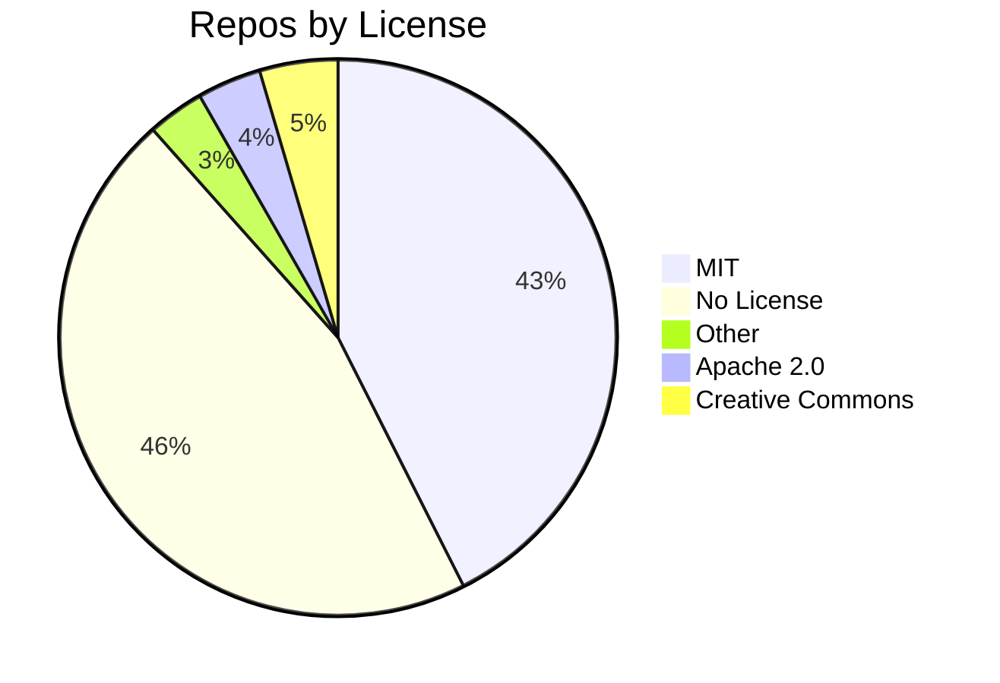

# Awesome MCP Server Git Repo Index

**A centralized resource for Model Context Protocol (MCP) server discovery, submission, and community indexes.**

## Explore the Index

<!-- AUTO-GENERATED BY find-awesome-mcp-servers SCRIPT -->

> [!TIP]
> Use the navigation below to explore the awesome MCP server index.

 

  

<b>📊 License Distribution</b>

<!-- END AUTO-GENERATED -->

---

## Official Submission Methods

> [!IMPORTANT]
> These are the official channels for submitting MCP servers to Anthropic's ecosystem.

| Platform                       | Description                                  | Link                                                                                                   |
| ------------------------------ | -------------------------------------------- | ------------------------------------------------------------------------------------------------------ |
| Anthropic Connectors Directory | Submit for Claude web/desktop/mobile/API     | [Submission Guide](https://support.claude.com/en/articles/12922490-remote-mcp-server-submission-guide) |
| MCP Registry                   | Official Anthropic-backed registry (preview) | [registry.modelcontextprotocol.io](https://registry.modelcontextprotocol.io/)                          |

## Community Marketplaces & Directories

| Platform        | Link                                                     |
| --------------- | -------------------------------------------------------- |
| Glama           | [glama.ai/mcp](https://glama.ai/mcp)                     |
| MCP Directory   | [mcpdirectory.ai](https://www.mcpdirectory.ai/)          |
| MCP Hub         | [mcphub.dev](https://mcphub.dev/)                        |
| MCP Market      | [mcpmarket.com](https://mcpmarket.com/)                  |
| MCPM Registry   | [mcpm.sh/registry](https://www.mcpm.sh/registry/)        |
| MCP Serve       | [mcpserve.com](https://mcpserve.com/)                    |
| MCP Server      | [mcpserver.cc](https://mcpserver.cc/)                    |
| MCP Server Spot | [mcpserverspot.com](https://www.mcpserverspot.com/)      |
| PulseMCP        | [pulsemcp.com/servers](https://www.pulsemcp.com/servers) |
| Smithery        | [smithery.ai](https://smithery.ai/)                      |

## MCP Servers by Category

### Productivity

-  [Fathom AI](https://github.com/agencyenterprise/fathom-mcp-server) - Chat with your meeting transcripts and gain insights faster.
