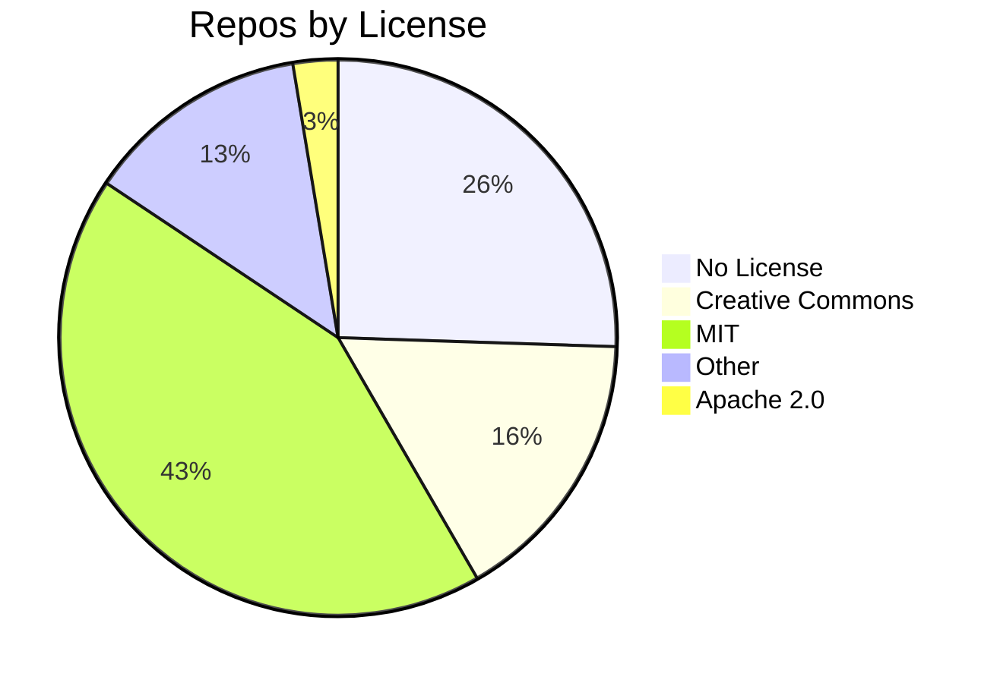

# Awesome MCP Indexes

**A meta-index of curated Model Context Protocol server lists, directories, registries, and marketplaces.**

## Explore the Index

<!-- AUTO-GENERATED BY find-awesome-mcp-servers SCRIPT -->

> [!TIP]
> Use the navigation below to explore the awesome MCP server index.

 

   

[Searchable catalog](https://jpatterson933.github.io/awesome-mcp-server-repo-index/) · [Machine-readable index](./data/indexes.json) · [Discovery audit](./data/discovery-audit.json) · [Coverage graph](./data/index-links.json)

<b>📊 License Distribution</b>

```mermaid
pie title Repos by License
    "No License" : 49
    "Creative Commons" : 31
    "MIT" : 82
    "Other" : 25
    "Apache 2.0" : 5
```

<!-- END AUTO-GENERATED -->

---

## What This Repository Indexes

This project tracks repositories and directories that curate multiple MCP servers. It does not attempt to list every individual MCP server directly.

GitHub candidates are discovered automatically, checked for index-oriented metadata, enriched with repository activity, and rendered into the generated pages above. Inclusion is a discovery signal, not an endorsement.

## Official MCP Submission Methods

> [!IMPORTANT]
> These are the official channels for submitting MCP servers to Anthropic's ecosystem.

| Platform                       | Description                                  | Link                                                                                                   |
| ------------------------------ | -------------------------------------------- | ------------------------------------------------------------------------------------------------------ |
| Anthropic Connectors Directory | Submit for Claude web/desktop/mobile/API     | [Submission Guide](https://support.claude.com/en/articles/12922490-remote-mcp-server-submission-guide) |
| MCP Registry                   | Official Anthropic-backed registry (preview) | [registry.modelcontextprotocol.io](https://registry.modelcontextprotocol.io/)                          |

## Community Marketplaces & Directories

| Platform        | Link                                                     |
| --------------- | -------------------------------------------------------- |
| Glama           | [glama.ai/mcp](https://glama.ai/mcp)                     |
| MCP Directory   | [mcpdirectory.ai](https://www.mcpdirectory.ai/)          |
| MCP Hub         | [mcphub.dev](https://mcphub.dev/)                        |
| MCP Market      | [mcpmarket.com](https://mcpmarket.com/)                  |
| MCPM Registry   | [mcpm.sh/registry](https://www.mcpm.sh/registry/)        |
| MCP Serve       | [mcpserve.com](https://mcpserve.com/)                    |
| MCP Server      | [mcpserver.cc](https://mcpserver.cc/)                    |
| MCP Server Spot | [mcpserverspot.com](https://www.mcpserverspot.com/)      |
| PulseMCP        | [pulsemcp.com/servers](https://www.pulsemcp.com/servers) |
| Smithery        | [smithery.ai](https://smithery.ai/)                      |

## Scope

Included projects should provide a curated list, directory, catalog, registry, or marketplace covering multiple MCP servers or related ecosystem resources. Individual servers, templates, tutorials, submission branches, backups, and obvious repository copies are outside this index's scope.

See [CONTRIBUTING.md](./CONTRIBUTING.md) for correction and addition guidance.
