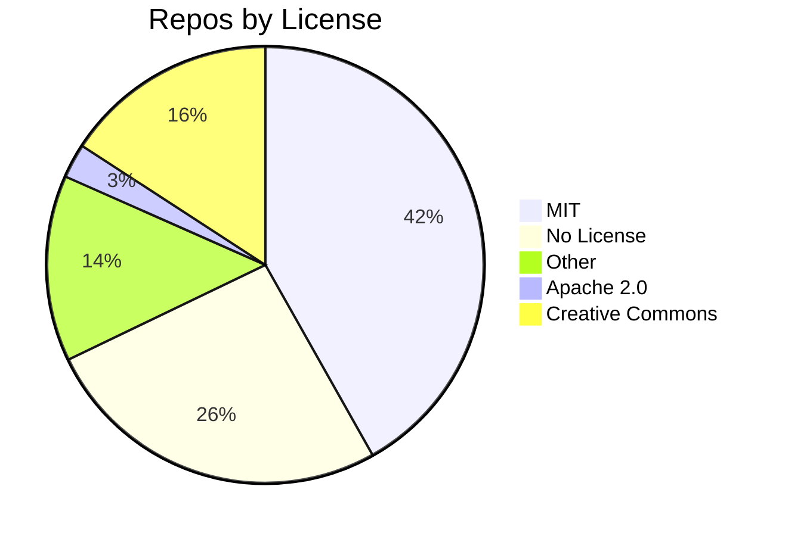

# Awesome MCP Indexes

**A meta-index of curated Model Context Protocol server lists, directories, registries, and marketplaces.**

## Explore the Index

<!-- AUTO-GENERATED BY find-awesome-mcp-servers SCRIPT -->

> [!TIP]
> Use the navigation below to explore the awesome MCP server index.

 

   

[Searchable catalog](https://jpatterson933.github.io/awesome-mcp-server-repo-index/) · [Machine-readable index](./data/indexes.json) · [Discovery audit](./data/discovery-audit.json) · [Coverage graph](./data/index-links.json)

<b>📊 License Distribution</b>

```mermaid
pie title Repos by License
    "MIT" : 82
    "No License" : 51
    "Other" : 27
    "Apache 2.0" : 5
    "Creative Commons" : 31
```

<!-- END AUTO-GENERATED -->

---

## What This Repository Indexes

This project tracks repositories and directories that curate multiple MCP servers. It does not attempt to list every individual MCP server directly.

GitHub candidates are discovered automatically, checked for index-oriented metadata, enriched with repository activity, and rendered into the generated pages above. Inclusion is a discovery signal, not an endorsement.

## Official MCP Submission Methods

> [!IMPORTANT]
> These are the official channels for submitting MCP servers to Anthropic's ecosystem and client registries.

| Platform                       | Description                                  | Link                                                                                                                                |
| ------------------------------ | -------------------------------------------- | ----------------------------------------------------------------------------------------------------------------------------------- |
| Anthropic Connectors Directory | Submit for Claude web/desktop/mobile/API     | [Submission Guide](https://support.claude.com/en/articles/12922490-remote-mcp-server-submission-guide)                              |
| GitHub MCP Registry            | Official GitHub & VS Code MCP server catalog | [GitHub Blog](https://github.blog/ai-and-ml/generative-ai/how-to-find-install-and-manage-mcp-servers-with-the-github-mcp-registry/) |
| MCP Registry                   | Official Anthropic-backed registry (preview) | [registry.modelcontextprotocol.io](https://registry.modelcontextprotocol.io/)                                                       |

## Community Marketplaces & Directories

| Platform            | Link                                                     |
| ------------------- | -------------------------------------------------------- |
| AI Agents Directory | [aiagentsdirectory.com](https://aiagentsdirectory.com/)  |
| awesome-mcp.tools   | [awesome-mcp.tools](https://awesome-mcp.tools/)          |
| Cursor Directory    | [cursor.directory/mcp](https://cursor.directory/mcp)     |
| Docker MCP Catalog  | [hub.docker.com](https://hub.docker.com/)                |
| FindMCP             | [findmcp.dev](https://findmcp.dev/)                      |
| Glama               | [glama.ai/mcp](https://glama.ai/mcp)                     |
| LobeHub Plugins     | [lobehub.com/plugins](https://lobehub.com/plugins)       |
| MCP Directory       | [mcpdirectory.ai](https://www.mcpdirectory.ai/)          |
| MCP Directory App   | [mcpdirectory.app](https://mcpdirectory.app/)            |
| MCP Find            | [mcpfind.org](https://mcpfind.org/)                      |
| MCP Hub             | [mcphub.dev](https://mcphub.dev/)                        |
| MCP Index           | [mcpindex.ai](https://mcpindex.ai/)                      |
| MCP Market          | [mcpmarket.com](https://mcpmarket.com/)                  |
| MCP Serve           | [mcpserve.com](https://mcpserve.com/)                    |
| MCP Server          | [mcpserver.cc](https://mcpserver.cc/)                    |
| MCP Server Spot     | [mcpserverspot.com](https://www.mcpserverspot.com/)      |
| MCP.Directory       | [mcp.directory](https://mcp.directory/)                  |
| MCP.so              | [mcp.so](https://mcp.so/)                                |
| MCPM Registry       | [mcpm.sh/registry](https://www.mcpm.sh/registry/)        |
| MCPServers.org      | [mcpservers.org](https://mcpservers.org/)                |
| PulseMCP            | [pulsemcp.com/servers](https://www.pulsemcp.com/servers) |
| SkillFlow.builders  | [skillflow.builders](https://skillflow.builders/)        |
| Smithery            | [smithery.ai](https://smithery.ai/)                      |

## Scope

Included projects should provide a curated list, directory, catalog, registry, or marketplace covering multiple MCP servers or related ecosystem resources. Individual servers, templates, tutorials, submission branches, backups, and obvious repository copies are outside this index's scope.

See [CONTRIBUTING.md](./CONTRIBUTING.md) for correction and addition guidance.
